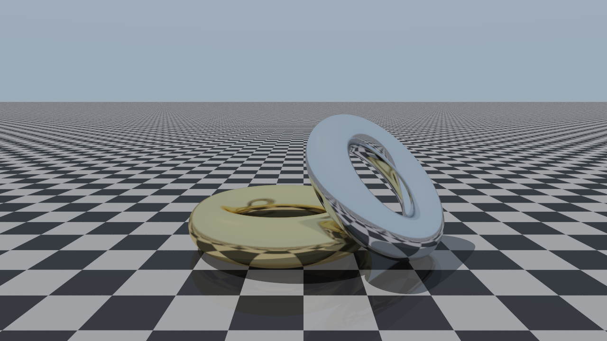

# ToriRender – CPU Parallel Ray Tracing of Donuts

ToriRender is a CPU-based C++ ray tracer that renders two torus-shaped donuts on a kitchen-style checkerboard floor. The project focuses on the rendering pipeline, scene configuration, CPU parallelisation, cluster execution through PBS job scripts, and performance measurement.

The renderer supports two CPU execution modes:

- **Serial CPU execution** for correctness checks and baseline timing.
- **Parallel CPU execution** using **MPI + OpenMP** for scalable rendering on multi-core systems and HPC nodes.

The rendering logic remains the same across serial and parallel modes. The difference is only in how the image work is divided, executed, collected, and logged.

## Rendered Samples

The repository contains rendered images inside `final/images`. Below are two sample outputs generated by the CPU renderer.

### Sample 1 – CPU render at 1280×720

This render uses 128 samples per pixel and depth 10. It shows the two torus objects, checkerboard floor reflections, shadows, and specular highlights.



### Sample 2 – CPU render at 2560×1440

This higher-resolution render uses 768 samples per pixel and depth 12. The extra samples reduce noise and make the reflection and lighting smoother.


## What the project does

ToriRender traces rays from the camera through every pixel of the image. For each pixel, multiple samples are taken to reduce aliasing and noise. Each ray is tested against the scene objects, including the torus geometry and the floor. The final pixel colour is computed from material properties, lighting, reflection depth, and background contribution.

The scene mainly contains:

- Two torus objects that appear like donuts.
- A checkerboard floor.
- Configurable camera position and field of view.
- Diffuse and metallic material parameters.
- Directional lighting.
- Reflection depth control.
- Anti-aliasing using samples per pixel.

The torus shape is represented as an implicit surface. Instead of storing a triangle mesh, the renderer evaluates torus geometry mathematically during ray intersection. This keeps the geometry compact and makes the project suitable for studying ray tracing and parallel rendering.

## Scene configuration

The scene is configured through `config/scene.json`. The JSON file controls camera settings, torus parameters, material properties, floor settings, and runtime options.

Important configuration groups:

- **Camera settings** define `look_from`, `look_at`, `view_up`, vertical field of view, image width, image height, samples per pixel, maximum reflection depth, and random seed.
- **Runtime settings** define whether the renderer runs in `serial` or `parallel` mode, along with the requested MPI ranks and OpenMP threads.
- **Torus settings** define the major radius, minor radius, centre, orientation axis, and material for each torus.
- **Material settings** define diffuse/metal behaviour, base colour, specular colour, shininess, fuzz, and reflection strength.
- **Scene settings** define light direction, sky background colours, floor height, floor checker scale, and floor materials.

This configuration-driven design makes it easy to test multiple resolutions, sample counts, reflection depths, and parallel settings without changing the C++ source code.

## Build targets

The main CPU target is:

```bash
torirender_cpu
```

This target can be used for both serial and MPI + OpenMP CPU execution.

The project also includes utility targets such as:

```bash
render_scene
point_classifier
```

`point_classifier` is useful for testing whether points are inside, outside, or on the torus surface.

## Local CPU run

For a basic local run, build the CPU renderer using CMake:

```bash
cmake -S . -B build -DCMAKE_BUILD_TYPE=Release
cmake --build build --target torirender_cpu -j
```

Run the renderer in serial mode:

```bash
./build/torirender_cpu config/scene.json output \
  --mode serial \
  --mpi-ranks 1 \
  --omp-threads 1
```

Run the renderer in parallel CPU mode:

```bash
./build/torirender_cpu config/scene.json final \
  --mode parallel \
  --mpi-ranks 8 \
  --omp-threads 5
```

Run with profiling enabled:

```bash
./build/torirender_cpu config/scene.json final \
  --mode parallel \
  --mpi-ranks 8 \
  --omp-threads 5 \
  --profile \
  --perf-dir final/perf \
  --run-label cpu_8x5
```

A convenience script can also be used:

```bash
bash scripts/local_run.sh config/scene.json output
```

## CPU parallelisation strategy

The parallel version uses a hybrid model:

- **MPI** distributes image rows across multiple processes.
- **OpenMP** parallelises row/pixel computation inside each MPI process.

This is a common CPU HPC pattern. MPI handles distributed-memory execution across processes or nodes, while OpenMP handles shared-memory threading inside each process.

## How MPI is used

MPI is used at the process level. Each MPI rank receives a subset of the image rows and renders only that region.

The high-level MPI workflow is:

1. Start multiple MPI ranks.
2. Load or broadcast the scene/runtime configuration.
3. Split the image into row ranges.
4. Assign each row range to one rank.
5. Let each rank render its local rows.
6. Gather all local image buffers on rank 0.
7. Let rank 0 write the final PNG and metrics.

The image is partitioned by rows because row blocks are simple, contiguous, and easy to gather. This avoids complicated tile ownership logic and keeps memory access predictable.

After each rank finishes its assigned rows, the partial colour buffers are gathered using `MPI_Gatherv`. This is useful because ranks may not always own the exact same number of rows. `MPI_Gatherv` allows different receive counts and displacements, so rank 0 can reconstruct the complete image correctly.

The root rank is responsible for final output work:

- writing the PNG image,
- appending metrics rows,
- writing heartbeat/status files,
- creating run reports,
- collecting per-rank resource information.

## How OpenMP is used

OpenMP is used inside each MPI rank to parallelise CPU work over rows and pixels.

A simplified version of the CPU loop looks like this:

```cpp
#pragma omp parallel
{
    #pragma omp single
    {
        // Start tile timing
    }

    #pragma omp for schedule(static)
    for (int y = tile_start; y < tile_end; ++y) {
        for (int x = 0; x < image_width; ++x) {
            // Trace rays and compute pixel colour
        }
    }

    #pragma omp single
    {
        // End tile timing and update heartbeat
    }
}
```

The important parts are:

- `#pragma omp parallel` creates a team of CPU threads.
- `#pragma omp for schedule(static)` divides rows among threads.
- `schedule(static)` is suitable here because pixel rows are similar enough in cost and have good memory locality.
- `#pragma omp single` is used for timing and status updates that should happen once per tile, not once per thread.

This gives two levels of CPU parallelism:

- MPI distributes large row ranges across ranks.
- OpenMP distributes rows within each rank across CPU threads.

For example, a run with 8 MPI ranks and 5 OpenMP threads per rank uses up to 40 CPU execution threads.

```bash
--mpi-ranks 8 --omp-threads 5
```

## PBS job scripts on AQuA

The repository includes PBS scripts for running CPU jobs on the AQuA cluster. The main CPU script is:

```bash
jobs/cpu.cmd
```

Submit a CPU job with default settings:

```bash
qsub jobs/cpu.cmd
```

Submit a parallel CPU job with overrides:

```bash
qsub -v MODE=parallel,MPI_RANKS=8,OMP_THREADS=5,CONFIG_PATH=config/scene.json,OUTPUT_DIR_NAME=final jobs/cpu.cmd
```

Submit a profiling run:

```bash
qsub -v MODE=parallel,MPI_RANKS=8,OMP_THREADS=5,PROFILE=1,PERF_DIR=final/perf,RUN_LABEL=cpu_8x5 jobs/cpu.cmd
```

## What the PBS CPU script does

The CPU PBS script automates cluster-side execution. It does more than simply call the binary.

It handles:

- checking that the script is running through PBS,
- creating a unique run ID,
- creating log and result directories,
- creating a scratch working directory,
- detecting allocated CPU slots from PBS variables,
- reading `$PBS_NODEFILE`,
- generating an MPI hostfile,
- configuring `MPI_RANKS` and `OMP_THREADS`,
- building the CPU target if needed,
- launching the renderer through `mpirun`,
- saving stdout and stderr logs,
- writing a run report,
- appending a summary row to the run log,
- copying output back from scratch,
- cleaning temporary scheduler files.

The script launches MPI roughly in this form:

```bash
mpirun --hostfile results/<run_id>.hostfile \
  -np <MPI_RANKS> \
  --oversubscribe \
  --bind-to core \
  --map-by slot:PE=<OMP_THREADS> \
  ./build/torirender_cpu config/scene.json final \
  --mode parallel \
  --mpi-ranks <MPI_RANKS> \
  --omp-threads <OMP_THREADS>
```

The important part is:

```bash
--map-by slot:PE=<OMP_THREADS>
```

This tells MPI that each rank should reserve a processing element group sized according to the requested OpenMP thread count. That keeps MPI rank placement consistent with OpenMP threading.

## AQuA workflow

The intended AQuA workflow is:

1. Edit `config/scene.json` for resolution, samples per pixel, depth, and runtime settings.
2. Submit `jobs/cpu.cmd` through `qsub`.
3. Let the job build and run in the allocated PBS environment.
4. Collect rendered images from the selected output directory.
5. Read logs from `logs/`.
6. Read run summaries from `results/`.
7. Read detailed run reports from `final/run_reports/`.
8. Analyse profiling data from `final/perf/` when profiling is enabled.

This makes the project reproducible because each run records its configuration, rank count, thread count, timing, output path, and status.

## Performance logging

ToriRender records several kinds of performance data.

Important outputs include:

- `serial_metrics.csv` for serial CPU runs.
- `parallel_metrics.csv` for MPI + OpenMP CPU runs.
- `resource_metrics.csv` for per-rank CPU/resource data.
- `final/perf/<run_id>.txt` for detailed profiling when `--profile` is enabled.
- `final/run_reports/<run_id>.txt` for PBS-level run summaries.

The metrics help compare:

- serial versus parallel execution,
- different MPI rank counts,
- different OpenMP thread counts,
- different image resolutions,
- different samples per pixel,
- different reflection depths.

A typical performance study can vary `MPI_RANKS` and `OMP_THREADS` while keeping the scene fixed. Then speedup and efficiency can be computed from the timing logs.

## Analysis script

The repository includes a Python analysis script for profiling output.

Example usage:

```bash
python3 scripts/analyze_perf.py --input final/perf --outdir final/perf
```

This can generate summary files and plots such as:

- performance analysis CSV,
- performance summary,
- time decomposition plots,
- overhead breakdown plots,
- speedup versus processor count,
- efficiency versus processor count,
- Karp–Flatt metric plots,
- total time versus processor count.

These outputs are useful for explaining whether the renderer scales well as more CPU resources are added.

## Output naming

Rendered images follow a descriptive filename format:

```text
cpu_<width>x<height>_ssp<samples>_depth<depth>_<date>_time_<time>.png
```

Example:

```text
cpu_1280x720_ssp128_depth10_2026-04-19_time_18h08m10s.png
```

This filename records the backend, resolution, samples per pixel, maximum depth, date, and time. That makes it easier to connect images to the exact run that produced them.

## Quality presets

For quick testing:

```json
{
  "image_width": 640,
  "image_height": 360,
  "samples_per_pixel": 1,
  "max_depth": 2
}
```

For better quality:

```json
{
  "image_width": 1280,
  "image_height": 720,
  "samples_per_pixel": 128,
  "max_depth": 10
}
```

For high-quality final renders:

```json
{
  "image_width": 2560,
  "image_height": 1440,
  "samples_per_pixel": 768,
  "max_depth": 12
}
```

Higher samples per pixel reduce noise but increase runtime. Higher depth allows more reflection bounces but also increases computation.

## Summary

ToriRender is a CPU-focused parallel ray tracer for torus/donut scenes. It uses C++ for rendering, MPI for distributed row-level decomposition, OpenMP for multi-threaded CPU computation within each rank, and PBS scripts for reproducible execution on the AQuA cluster.

The project demonstrates:

- mathematical torus rendering,
- configurable scene description,
- serial CPU baseline rendering,
- MPI-based process-level parallelism,
- OpenMP-based thread-level parallelism,
- PBS-based cluster execution,
- run reports and resource logging,
- profiling-based scaling analysis.

The main idea is simple: split the image into row blocks, render those blocks in parallel on CPU cores, gather the final image, and record enough metrics to analyse performance properly.
